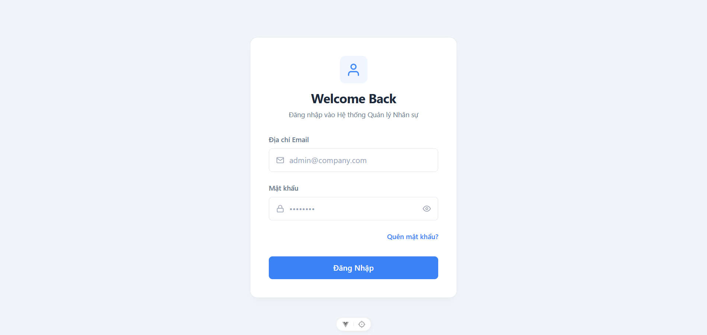
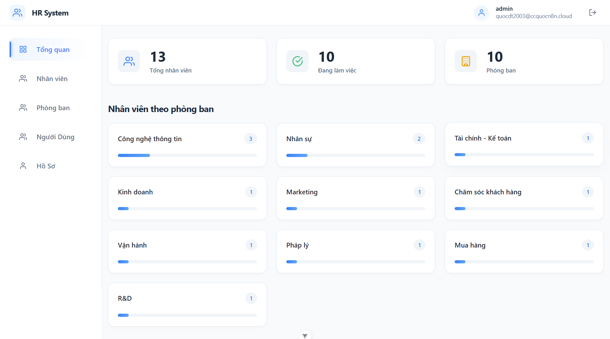
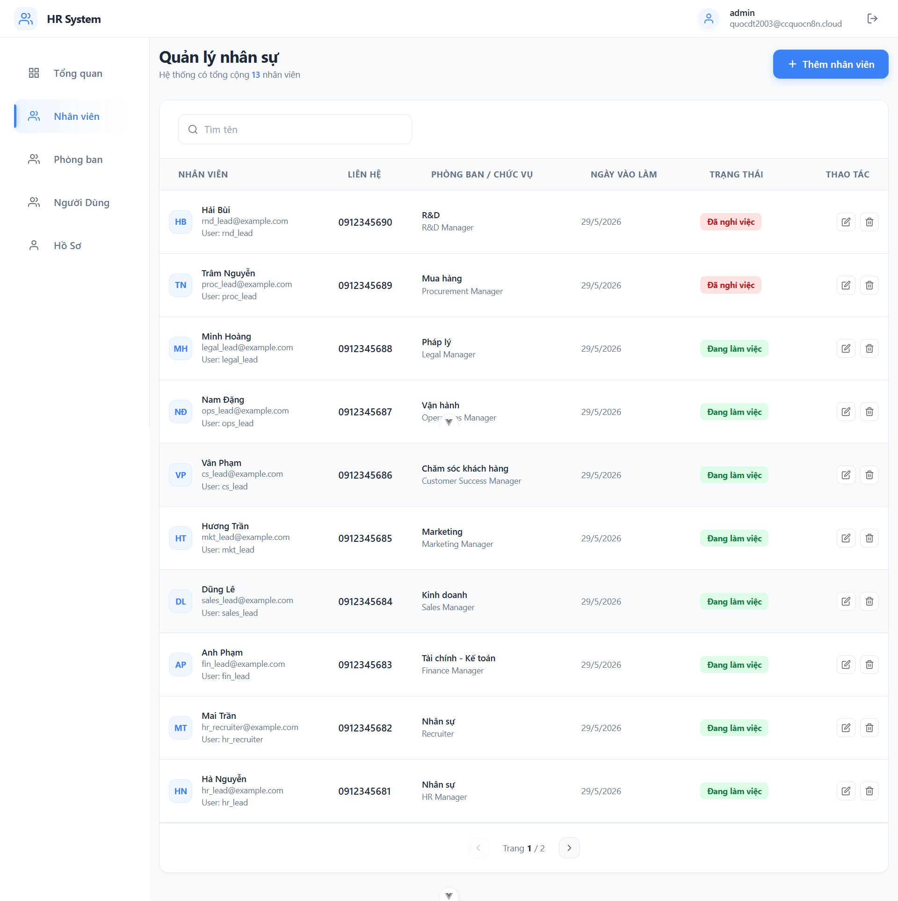
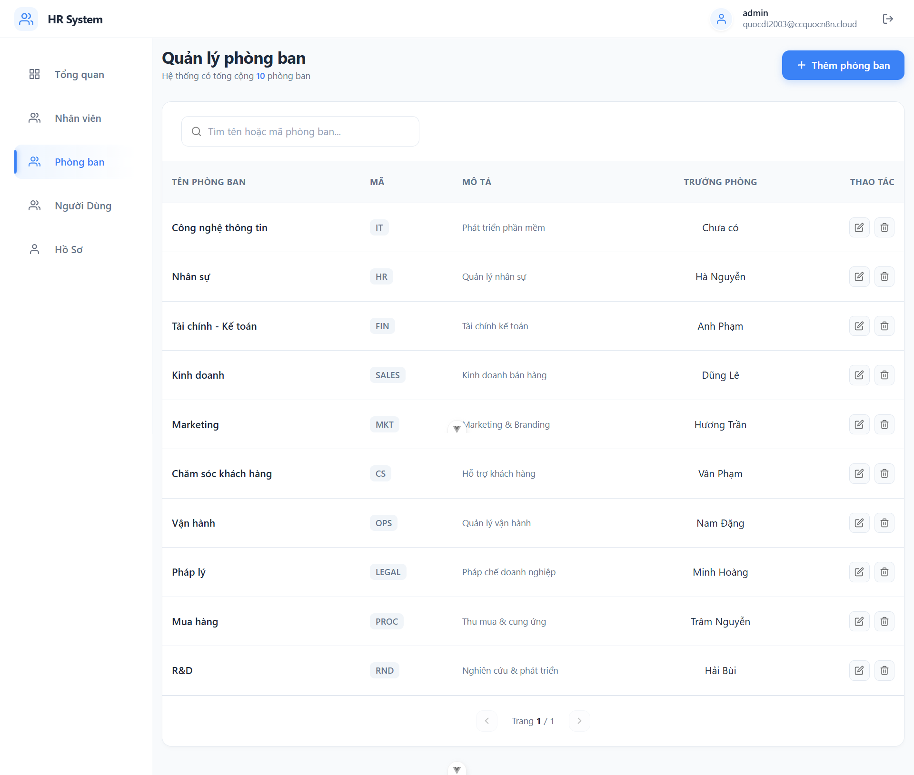
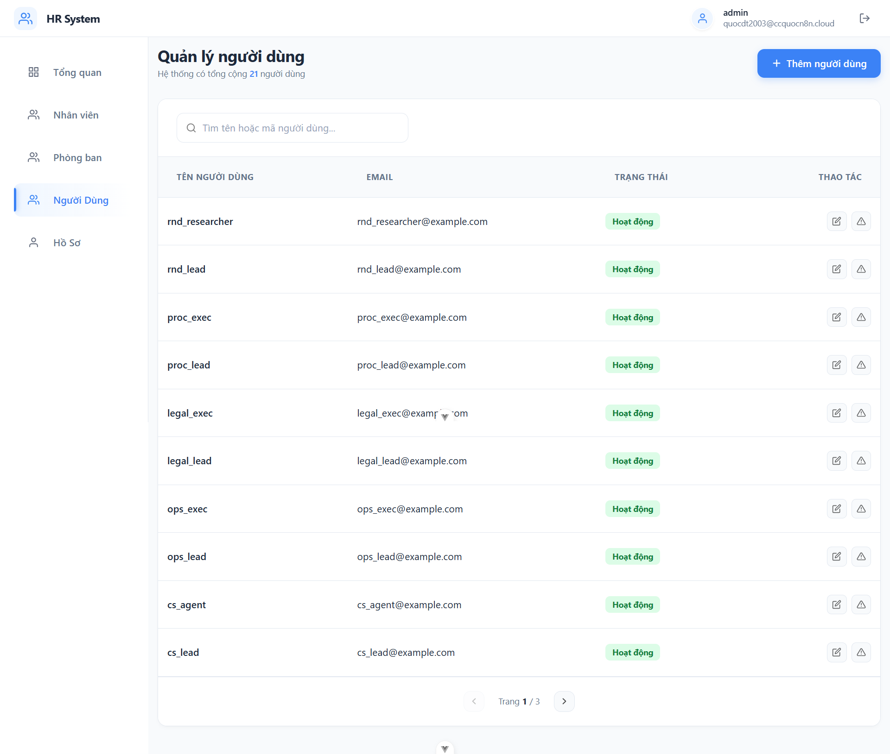
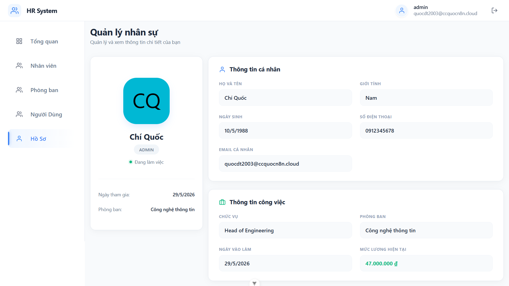

# Hệ Thống Quản Lý Nhân Sự (HR Management System)

[](https://deepwiki.com/Quocdev03/HR_Management)


Một ứng dụng Quản Lý Nhân Sự (HRM) toàn diện (full-stack) được xây dựng với Backend bằng Go và Frontend bằng Vue.js 3. Hệ thống này cung cấp các chức năng cốt lõi để quản lý nhân viên, phòng ban và tài khoản người dùng cùng với phân quyền truy cập.

## 🛠️ Công Nghệ Sử Dụng (Tech Stack)

- **Backend:** Go, Gin, GORM, Go-Redis, JWT
- **Frontend:** Vue.js 3 (Composition API), Vite, Pinia, Vue Router, Axios
- **Database:** MySQL
- **Cache/Rate Limiter:** Redis
- **DevOps:** Docker, Docker Compose

## ✨ Tính Năng

### Backend (Go)

- **RESTful API:** Xây dựng với web framework Gin.
- **ORM:** Tương tác cơ sở dữ liệu hiệu quả bằng GORM.
- **Database:** Hỗ trợ MySQL.
- **Xác Thực (Authentication):** Xác thực an toàn dựa trên JWT (JSON Web Token) với cơ chế **Refresh Token** (token rotation) — Access Token ngắn hạn, Refresh Token dài hạn lưu trong Redis.
- **Token Blacklist:** Access token bị vô hiệu hoá sau đăng xuất và lưu vào Redis với TTL bằng thời gian hết hạn còn lại — tự động dọn dẹp, không lưu vĩnh viễn.
- **Phân Quyền (Authorization):** Middleware Phân Quyền Dựa Trên Vai Trò (RBAC) để bảo vệ các API (`admin`, `hr`, `employee`).
- **Bộ Nhớ Đệm (Caching) & Giới Hạn Request (Rate Limiting):** Sử dụng Redis để lưu cache các API GET và giới hạn số lượt đăng nhập.
- **Kiến Trúc Tầng (Layered Architecture):** Tuân thủ mô hình chuẩn Handler -> Service -> Repository.
- **Cấu Hình:** Cấu hình theo môi trường sử dụng file `.env`.
- **Container Hóa (Containerization):** Toàn bộ các dịch vụ (API, MySQL, Redis) được đóng gói bằng Docker và `docker-compose`.
- **Quản Lý Cơ Sở Dữ Liệu:** Bao gồm các script để khởi tạo, migration và chèn dữ liệu mẫu (seeding).
- **Graceful Shutdown:** Server xử lý các tín hiệu tắt một cách an toàn, đảm bảo các yêu cầu đang thực thi được hoàn tất trước khi dừng hẳn.

### Frontend (Vue.js)

- **Framework Hiện Đại:** Xây dựng bằng Vue 3 sử dụng Composition API.
- **Công Cụ Build:** Phát triển cực nhanh và tối ưu hóa file build bằng Vite.
- **Quản Lý Trạng Thái (State Management):** Quản lý trạng thái tập trung với Pinia.
- **Định Tuyến (Routing):** Xử lý định tuyến SPA bằng Vue Router, bao gồm các route bảo mật và điều hướng theo vai trò.
- **Giao Diện CRUD:** Giao diện người dùng trực quan để quản lý Nhân Viên, Phòng Ban và Người Dùng.
- **Bảng Điều Khiển (Dashboard):** Bảng thống kê tập trung hiển thị các thông số chính của hệ thống.
- **HTTP Client:** Giao tiếp API qua instance Axios đã được cấu hình sẵn với các interceptor để quản lý token và xử lý lỗi.
- **Silent Refresh:** Khi Access Token hết hạn (401), Axios interceptor tự động gọi `/auth/refresh`, xếp hàng các request đang chờ và retry tất cả sau khi có token mới — minh bạch với người dùng.
- **API Interceptor Refactor:** Đã tối ưu logic xử lý token refresh, tách helper (`processQueue`, `clearAuthData`), áp dụng `async/await` và chuẩn hoá code theo JavaScript Style Guide.
- **Giao Diện Đáp Ứng (Responsive UI):** Thiết kế hiển thị tốt trên nhiều kích thước màn hình.
- **Thành Phần UI Hiện Đại:** Bao gồm các component dùng lại như modal, hộp thoại xác nhận và skeleton loader giúp cải thiện trải nghiệm người dùng.

## 📸 Ảnh Chụp Màn Hình (Screenshots)

|                Trang Đăng Nhập                |            Bảng Điều Khiển (Dashboard)            |
| :-------------------------------------------: | :-----------------------------------------------: |
|  |  |

|                 Quản Lý Nhân Viên                  |                  Quản Lý Phòng Ban                   |
| :------------------------------------------------: | :--------------------------------------------------: |
|  |  |

|               Quản Lý Người Dùng                |                 Hồ Sơ Cá Nhân                 |
| :---------------------------------------------: | :-------------------------------------------: |
|  |  |

## ⚙️ Cấu Trúc Dự Án (Project Structure)

Kho mã nguồn được sắp xếp theo cấu trúc monorepo bao gồm `backend` và `frontend`.

```text
.
├── backend/                # Ứng dụng Backend Go
│   ├── cmd/                # Các điểm khởi chạy chính (server, setup)
│   ├── internal/           # Logic lõi của ứng dụng
│   │   ├── config/         # Cấu hình (env, db, jwt)
│   │   ├── handler/        # Các HTTP Handler (controllers)
│   │   ├── middleware/     # API Middleware (auth, cors, cache)
│   │   ├── model/          # Các Model và DTO
│   │   ├── repository/     # Tầng truy xuất dữ liệu (GORM)
│   │   ├── router/         # Khai báo các API route
│   │   └── service/        # Logic nghiệp vụ (Business logic)
│   ├── go.mod
│   └── ...
├── frontend/               # Ứng dụng Frontend Vue.js
│   ├── public/
│   ├── src/
│   │   ├── api/            # Cấu hình và Axios instance
│   │   ├── assets/         # Tài nguyên tĩnh (CSS, hình ảnh)
│   │   ├── components/     # Component Vue dùng lại
│   │   ├── helpers/        # Các hàm hỗ trợ và composable
│   │   ├── layout/         # Giao diện khung (layout) chính
│   │   ├── router/         # Cấu hình Vue Router
│   │   ├── store/          # Quản lý trạng thái bằng Pinia
│   │   └── views/          # Các component Trang (Pages)
│   ├── package.json
│   └── ...
├── docker-compose.yml      # Cấu hình dịch vụ Docker (MySQL, Redis)
├── Makefile                # Các lệnh hỗ trợ quá trình phát triển
└── database.sql            # File định nghĩa Schema SQL thuần
```

## 🔐 Danh Sách API (API Endpoints)

API được đánh dấu phiên bản `/api/v1`. Hầu hết các endpoint yêu cầu token xác thực JWT qua tiêu đề `Bearer`.

- **Xác Thực (Authentication - `/auth`)**
   - `POST /login`: Đăng nhập và nhận JWT.
   - `GET /profile`: Lấy thông tin hồ sơ của người dùng đang đăng nhập.
   - `POST /logout`: Đăng xuất, blacklist access token (Redis TTL), xoá refresh token.
   - `POST /refresh`: Lấy access token mới bằng refresh token (token rotation).

- **Nhân Viên (Employees - `/employees`)**
   - `GET /`: Lấy danh sách nhân viên có phân trang.
   - `POST /`: Tạo nhân viên mới (admin, hr).
   - `GET /:id`: Lấy thông tin một nhân viên theo ID.
   - `PUT /:id`: Cập nhật nhân viên (admin, hr).
   - `DELETE /:id`: Xóa nhân viên (chỉ admin).

- **Phòng Ban (Departments - `/departments`)**
   - `GET /`: Lấy danh sách tất cả phòng ban.
   - `POST /`: Tạo phòng ban mới (chỉ admin).
   - `GET /:id`: Lấy thông tin một phòng ban theo ID.
   - `PUT /:id`: Cập nhật phòng ban (chỉ admin).
   - `DELETE /:id`: Xóa phòng ban (chỉ admin).

- **Người Dùng (Users - `/users`)**
   - `GET /`: Lấy danh sách người dùng có phân trang (chỉ admin).
   - `POST /`: Tạo người dùng mới (chỉ admin).
   - `GET /available`: Lấy các user chưa được liên kết với hồ sơ nhân viên (chỉ admin).
   - `GET /:id`: Lấy thông tin một người dùng theo ID (chỉ admin).
   - `PUT /:id`: Cập nhật người dùng (chỉ admin).
   - `DELETE /:id`: Xóa người dùng (chỉ admin).

- **Bảng Điều Khiển (Dashboard - `/dashboard`)**
   - `GET /stats`: Lấy thống kê hệ thống (số lượng nhân viên, phòng ban, v.v.).

## 🚀 Hướng Dẫn Cài Đặt (Getting Started)

### Yêu Cầu Cài Đặt (Prerequisites)

- Git
- Docker và Docker Compose
- Go (phiên bản 1.22 trở lên)
- Node.js (phiên bản 20 trở lên) và npm

### 1. Clone Repository

```sh
git clone https://github.com/quocdev03/HR_Management.git
cd HR_Management
```

### 2. Cài Đặt Backend

Backend, database và cache được quản lý bởi Docker Compose.

**a. Khởi Chạy Docker Containers**
Lệnh này sẽ build và chạy các dịch vụ MySQL, Redis dưới nền.

```sh
docker-compose up -d
```

> Các dịch vụ sẽ chạy tại:
>
> - **MySQL**: `localhost:3306`
> - **Redis**: `localhost:6379`

**b. Cấu Hình Biến Môi Trường (Environment Variables)**

Copy file cấu hình mẫu và đặt vào thư mục `backend`.

```sh
cp .env.example backend/.env
```

Mở file `backend/.env` và đảm bảo các cấu hình database, Redis khớp với thiết lập trong `docker-compose.yml`. Mặc định không cần thay đổi gì nếu bạn chạy Docker trên `localhost`.

```env
# backend/.env

# App
APP_PORT=8080
APP_ENV=development

# Database (MySQL) - dùng tên service của Docker
DB_HOST=localhost
DB_PORT=3306
DB_USER=root
DB_PASSWORD=password123
DB_NAME=hrm_db

# JWT
JWT_SECRET=your_jwt_secret_key
JWT_EXPIRE_HOUR=1
REFRESH_EXPIRE_DAY=7

# ... các biến khác

# Redis - dùng tên service của Docker
REDIS_HOST=redis
REDIS_PORT=6379
# ... các biến khác
```

> **Lưu ý:** Khi chạy backend **trong Docker container**, giá trị `DB_HOST` và `REDIS_HOST` phải là tên service Docker (`mysql`, `redis`). Khi chạy backend **trực tiếp trên máy host** (không qua Docker), dùng `localhost`.

**c. Thiết Lập Cơ Sở Dữ Liệu**
Lệnh này sẽ tạo cấu trúc bảng, chạy migration và chèn dữ liệu khởi tạo ban đầu (người dùng, phòng ban, v.v.).

```sh
go run backend/cmd/setup/main.go
```

> **Tài Khoản Admin Mặc Định:**
>
> Thông tin tài khoản mặc định được cấu hình qua biến môi trường trong file `backend/.env`. Xem file `.env.example` để biết giá trị khởi tạo. **Vui lòng đổi mật khẩu ngay sau khi đăng nhập lần đầu.**

**d. Chạy Server Backend**
Bạn có thể chạy server trực tiếp bằng lệnh go hoặc dùng Makefile.

```sh
# Cách 1: Dùng Go
go run backend/cmd/server/main.go

# Cách 2: Dùng Makefile
make run
```

API server sẽ chạy tại `http://localhost:8080`.

### 3. Cài Đặt Frontend

**a. Cấu Hình Biến Môi Trường**
Tạo file `.env` trong thư mục `frontend` cho máy chủ phát triển Vite.

```sh
# Ở thư mục gốc của dự án
echo "VITE_API_URL=http://localhost:8080/api/v1" > frontend/.env
```

**b. Cài Đặt Thư Viện (Dependencies)**

```sh
cd frontend
npm install
```

**c. Khởi Chạy Môi Trường Phát Triển Frontend**

```sh
npm run dev
```

Ứng dụng frontend sẽ chạy tại `http://localhost:3000`.

## 📜 Các Lệnh Makefile

File `Makefile` cung cấp các lệnh phím tắt tiện dụng cho quá trình code.

- `make docker-up`: Khởi chạy container MySQL và Redis.
- `make docker-down`: Dừng tất cả các container đang chạy.
- `make docker-logs`: Xem log từ container `app`.
- `make run`: Chạy API server nội bộ.
- `make build`: Biên dịch (build) file thực thi Go.
- `make clean`: Xóa file build thực thi.
- `make tidy`: Dọn dẹp và cập nhật các module Go.

## 📐 Quy Chuẩn Code (Code Style)

- **Backend (Go):** Tuân thủ idiomatic Go — error wrapping, sentinel errors, godoc comments, layered architecture.
- **Frontend (JavaScript/Vue):** Áp dụng **JavaScript Style Guide** — single quotes, 2-space indent, `const`/`let` (không dùng `var`), arrow functions, template literals, `async/await` thay vì promise chain, optional chaining (`?.`), và trailing commas.
