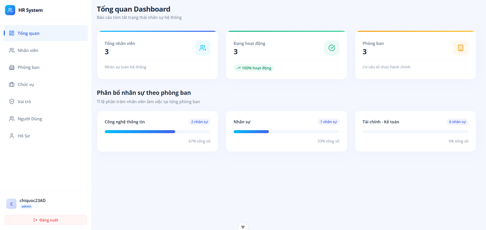
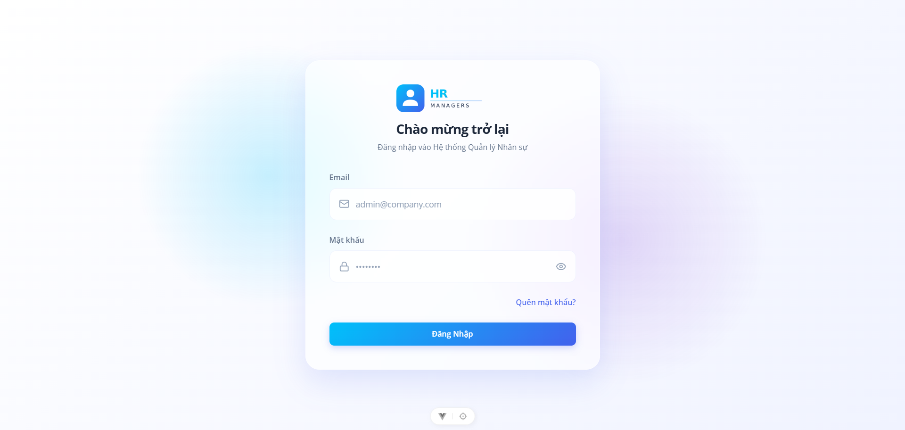
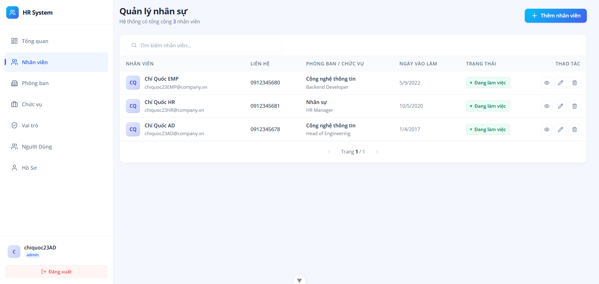
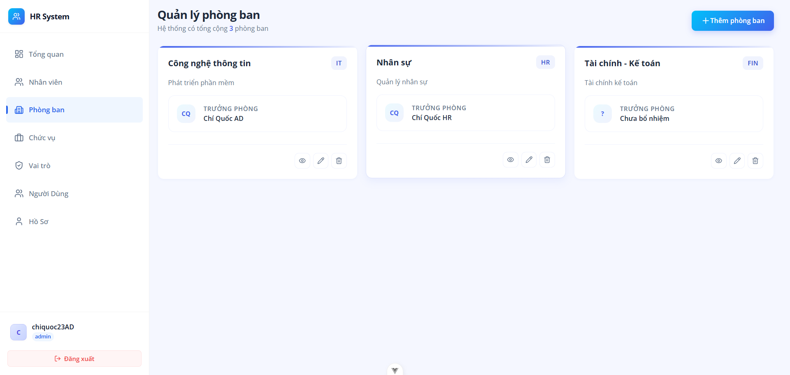
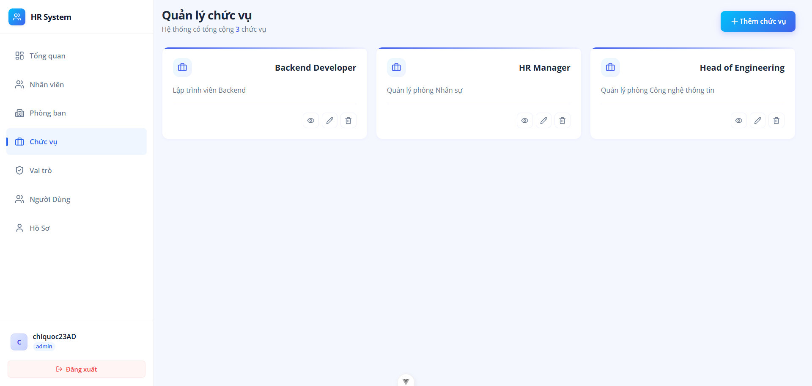
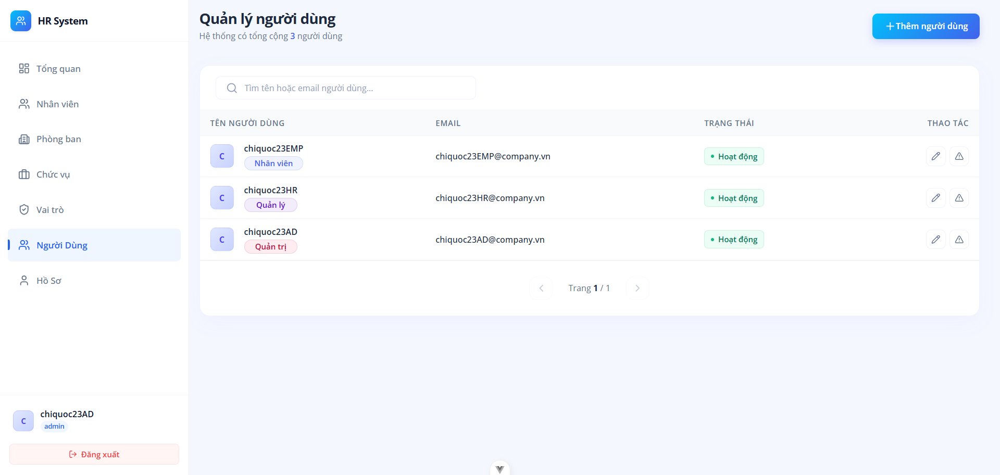
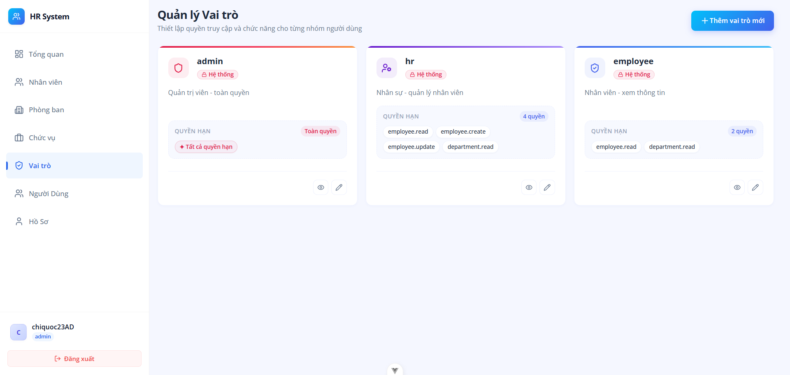
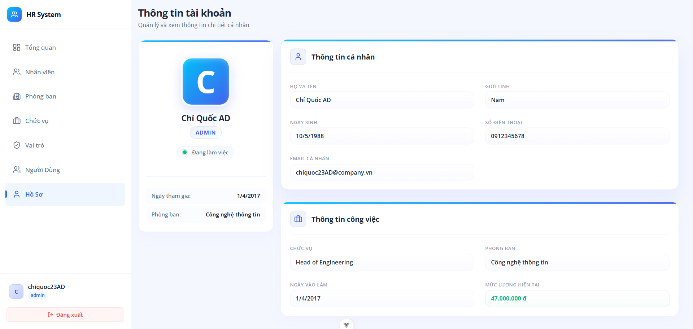
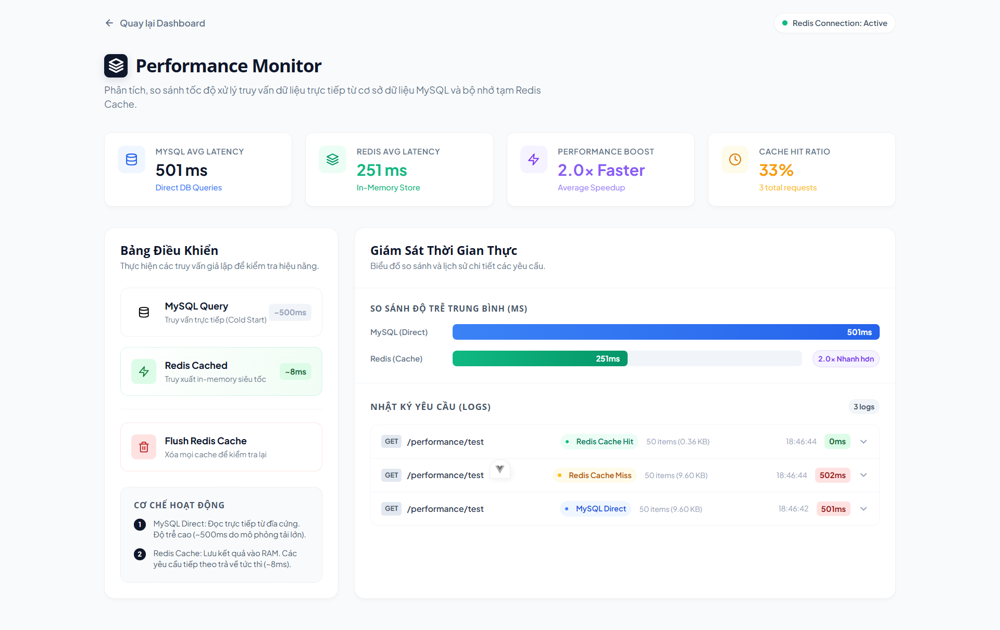

# Hệ Thống Quản Lý Nhân Sự (HR Management System)


Ứng dụng Quản Lý Nhân Sự (HRM) full-stack với Backend Go (Gin, GORM, MySQL, Redis) và Frontend Vue.js 3 (Vite, Pinia, Vue Router). Hỗ trợ quản lý nhân viên, phòng ban, chức vụ, tài khoản và phân quyền truy cập chi tiết.

---

## 📸 Giao diện ứng dụng

### Dashboard Thống kê



### Trang Đăng nhập



### Quản lý Nhân Viên



### Quản lý Phòng Ban



### Quản lý Chức Vụ



### Quản lý Tài Khoản



### Quản lý Vai Trò



### Hồ Sơ Cá Nhân



### Kiểm tra Hiệu Suất (Mô phỏng)



---

## 🛠️ Tech Stack

- **Backend:** Go 1.25, Gin, GORM, Go-Redis, JWT
- **Frontend:** Vue.js 3 (Composition API), Vite, Pinia, Vue Router, Axios
- **Database:** MySQL 8.0
- **Cache / Rate Limiter:** Redis 7.2
- **DevOps:** Docker, Docker Compose

---

## 📖 Hướng Dẫn Cài Đặt & Chạy Ứng Dụng

Vui lòng xem hướng dẫn chi tiết ở phần **[Getting Started](#-getting-started--hr-management-system)** bên dưới.

---

## 🔐 API Endpoints chính

API được versioned tại `/api/v1`. Hầu hết endpoints yêu cầu JWT Bearer token trong header.

| Method   | Endpoint                  | Mô tả                            | Quyền truy cập      |
| :------- | :------------------------ | :------------------------------- | :------------------ |
| `POST`   | `/api/v1/auth/login`      | Đăng nhập                        | Public              |
| `GET`    | `/api/v1/auth/me`         | Lấy thông tin tài khoản hiện tại | User đăng nhập      |
| `POST`   | `/api/v1/auth/logout`     | Đăng xuất (blacklist token)      | User đăng nhập      |
| `POST`   | `/api/v1/auth/refresh`    | Làm mới access token             | User đăng nhập      |
| `GET`    | `/api/v1/employees`       | Lấy danh sách nhân viên          | `employee.read`     |
| `GET`    | `/api/v1/employees/:id`   | Lấy chi tiết nhân viên           | `employee.read`     |
| `POST`   | `/api/v1/employees`       | Tạo mới nhân viên                | `employee.create`   |
| `PATCH`  | `/api/v1/employees/:id`   | Cập nhật nhân viên               | `employee.update`   |
| `DELETE` | `/api/v1/employees/:id`   | Xóa nhân viên                    | `employee.delete`   |
| `GET`    | `/api/v1/departments`     | Lấy danh sách phòng ban          | `department.read`   |
| `GET`    | `/api/v1/departments/:id` | Lấy chi tiết phòng ban           | `department.read`   |
| `POST`   | `/api/v1/departments`     | Tạo mới phòng ban                | `department.create` |
| `PATCH`  | `/api/v1/departments/:id` | Cập nhật phòng ban               | `department.update` |
| `DELETE` | `/api/v1/departments/:id` | Xóa phòng ban                    | `department.delete` |
| `GET`    | `/api/v1/positions`       | Lấy danh sách chức vụ            | `department.read`   |
| `GET`    | `/api/v1/positions/:id`   | Lấy chi tiết chức vụ             | `department.read`   |
| `POST`   | `/api/v1/positions`       | Tạo mới chức vụ                  | `department.update` |
| `PATCH`  | `/api/v1/positions/:id`   | Cập nhật chức vụ                 | `department.update` |
| `DELETE` | `/api/v1/positions/:id`   | Xóa chức vụ                      | `department.update` |
| `GET`    | `/api/v1/users`           | Lấy danh sách tài khoản          | `user.read` (Admin) |
| `GET`    | `/api/v1/roles`           | Lấy danh sách vai trò            | `user.read` (Admin) |
| `GET`    | `/api/v1/roles/:id`       | Lấy chi tiết vai trò             | `user.read` (Admin) |
| `POST`   | `/api/v1/roles`           | Tạo mới vai trò                  | `user.update`       |
| `PATCH`  | `/api/v1/roles/:id`       | Cập nhật vai trò                 | `user.update`       |
| `DELETE` | `/api/v1/roles/:id`       | Xóa vai trò                      | `user.update`       |
| `GET`    | `/api/v1/dashboard/stats` | Lấy thống kê cho trang Dashboard | Đăng nhập           |
| `GET`    | `/api/v1/health`          | Kiểm tra trạng thái của server   | Public              |

---

## 🗄️ Redis Caching & Rate Limiting Strategy

| Chức năng        | Định dạng Key            | TTL (Thời gian sống)     | Mục đích                         |
| :--------------- | :----------------------- | :----------------------- | :------------------------------- |
| Token Blacklist  | `blacklist:{token}`      | Tương ứng thời hạn token | Đăng xuất an toàn                |
| Rate Limit Login | `rate_limit:login:{IP}`  | 1 phút                   | Chống brute-force đăng nhập      |
| Refresh Token    | `refresh_token:{userID}` | 7 ngày                   | Token rotation, duy trì session  |
| Dashboard Cache  | `dashboard:stats`        | 1 giờ                    | Tăng tốc độ load trang Dashboard |

## 🚀 Getting Started — HR Management System

> **Tài liệu hướng dẫn cài đặt và khởi chạy dự án trong môi trường phát triển (Development).**

---

## ✅ Yêu cầu hệ thống

Chỉ cần cài đặt **Docker Desktop** trên máy của bạn:

- **Windows / macOS:** Tải và cài đặt tại [Docker Desktop](https://www.docker.com/products/docker-desktop)
- **Linux:** Cài đặt thông qua package manager: `sudo apt install docker.io docker-compose-plugin`

---

## ⚡ Khởi chạy dự án (Development)

### Trên Windows (Sử dụng Command Prompt / CMD)

Mở CMD trong thư mục gốc của dự án và chạy:

```cmd
:: Lần đầu tiên chạy (để thiết lập DB, chạy migration và seed dữ liệu mẫu)
start-dev.bat setup

:: Các lần tiếp theo chạy (chỉ khởi động hệ thống)
start-dev.bat
```

### Trên macOS / Linux (Sử dụng Terminal)

Mở Terminal trong thư mục gốc của dự án và chạy:

```bash
# Lần đầu tiên chạy: Khởi chạy docker compose, sau đó chạy migrate và seed
docker compose -f docker-compose.dev.yml up -d
docker compose -f docker-compose.dev.yml run --rm migrate
docker compose -f docker-compose.dev.yml run --rm seed

# Các lần tiếp theo chạy
docker compose -f docker-compose.dev.yml up -d
```

---

## 🌍 Các cổng truy cập (Ports)

Sau khi hệ thống khởi chạy thành công:

- **Frontend (Vue 3 + Vite HMR):** [http://localhost:5173](http://localhost:5173)
- **Backend API (Go + Gin):** [http://localhost:8080/api/v1/health](http://localhost:8080/api/v1/health)

---

## 🔑 Tài khoản đăng nhập demo

Hệ thống đã được tự động seed các tài khoản mẫu sau trong môi trường dev:

| Vai trò (Role)           | Email đăng nhập           | Mật khẩu (Password) |
| ------------------------ | ------------------------- | ------------------- |
| **Admin**                | `chiquoc23AD@company.vn`  | `chiquoc23AD`       |
| **HR (Nhân sự)**         | `chiquoc23HR@company.vn`  | `chiquoc23HR`       |
| **Employee (Nhân viên)** | `chiquoc23EMP@company.vn` | `chiquoc23EMP`      |

---

## 📋 Các lệnh quản lý khác (Windows CMD)

| Mục đích                     | Lệnh chạy              |
| ---------------------------- | ---------------------- |
| **Dừng hệ thống**            | `start-dev.bat down`   |
| **Xem logs**                 | `start-dev.bat logs`   |
| **Xem trạng thái container** | `start-dev.bat status` |

---

## 🔧 Cấu hình biến môi trường (.env)

Khi chạy `start-dev.bat`, file `.env` sẽ tự động được copy từ `.env.example` nếu chưa tồn tại.
Để tùy chỉnh cổng kết nối hoặc thông số DB, bạn có thể chỉnh sửa trực tiếp trong file `.env`:

```env
APP_PORT=8080        # Cổng chạy Backend API
VITE_PORT=5173       # Cổng chạy Frontend
DB_PASSWORD=change_me_strong_db_password   # Mật khẩu MySQL
JWT_SECRET=change_me_min_32_chars_cryptographically_random_key # Khóa ký JWT
```

---

## 🐛 Xử lý một số lỗi thường gặp

| Hiện tượng                       | Nguyên nhân & Cách khắc phục                                                                                                 |
| -------------------------------- | ---------------------------------------------------------------------------------------------------------------------------- |
| `Docker is not running`          | Docker Desktop chưa được mở hoặc đang khởi động. Hãy mở Docker Desktop và đợi nó báo xanh.                                   |
| Cổng `5173` hoặc `8080` bị chiếm | Một ứng dụng khác đang dùng cổng này. Bạn có thể sửa `VITE_PORT` / `APP_PORT` tương ứng trong file `.env` rồi khởi động lại. |
| Container dừng bất thường        | Chạy lệnh `start-dev.bat logs` để xem thông tin lỗi của container đó.                                                        |
