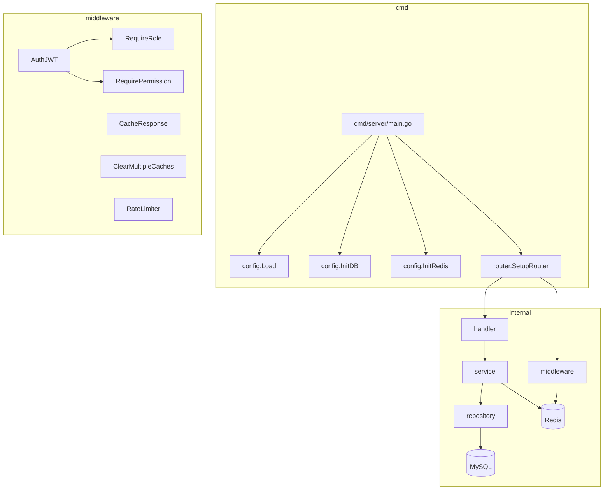

# 🔍 Backend Analysis — HR Management System

> **Stack**: Go 1.25 + Gin + GORM + MySQL 8.0 + Redis 7.2  
> **Kiến trúc**: Layered — `Handler → Service → Repository`, DI thủ công, interface-based  
> **Module**: `chiquoc_hocgolang`

---

## Kiến trúc tổng quan



### Domain entities

| Entity | Table | Soft Delete | Quan hệ |
|---|---|---|---|
| `User` | `users` | ✅ | belongsTo `Role` |
| `Employee` | `employees` | ✅ | belongsTo `User`, belongsTo `Department` |
| `Department` | `departments` | ✅ | hasMany `Employee`, belongsTo `Employee` (manager) |
| `Role` | `roles` | ✅ | — |
| `Permission` | `permissions` | ✅ | M2M via `RolePermission`, `UserPermission` |

---

## 🚨 CRITICAL — Phải sửa ngay

### 1. Logger labels bị hoán đổi
**File**: [loggers.go](file:///c:/Users/ccquo/Downloads/Compressed/hr_managerment_system/backend/internal/utils/loggers.go#L11-L13)

```go
infoLogger  = log.New(os.Stdout, "[APP-INFO]  ", ...)
errorLogger = log.New(os.Stdout, "[APP-WARN] ", ...)  // ← WARN label cho ERROR logger?!
warnLogger  = log.New(os.Stderr, "[APP-ERROR]  ", ...) // ← ERROR label cho WARN logger?!
```

- `errorLogger` có prefix `[APP-WARN]` — ghi nhận ERROR nhưng hiện WARN.
- `warnLogger` có prefix `[APP-ERROR]` — ghi nhận WARN nhưng hiện ERROR.
- Hệ quả: **Log aggregation (ELK, Grafana, Datadog) sẽ phân loại sai severity** → bỏ sót lỗi nghiêm trọng.

---

### 2. CORS Middleware mở toàn bộ (`*`) — bỏ qua config `CORS_ALLOWED_ORIGINS`
**File**: [middleware.go](file:///c:/Users/ccquo/Downloads/Compressed/hr_managerment_system/backend/internal/middleware/middleware.go#L146-L160)

```go
func CORS() gin.HandlerFunc {
    return func(ctx *gin.Context) {
        ctx.Header("Access-Control-Allow-Origin", "*")  // ← Hardcode wildcard!
```

Bạn đã có config `CORS_ALLOWED_ORIGINS` trong `.env` và inject vào compose, nhưng **middleware hoàn toàn không đọc nó**. Mọi origin đều được phép → credential-based attacks có thể xảy ra.

---

### 3. Default password trong production fallback
**File**: [config.go](file:///c:/Users/ccquo/Downloads/Compressed/hr_managerment_system/backend/internal/config/config.go#L73-L78)

```go
Password: getEnv("DB_PASSWORD", "password123"),
// ...
SecretKey: getEnv("JWT_SECRET", "your-super-secret-key-min-32-chars-change-in-production"),
```

Nếu env var thiếu (vd: deploy lên server quên set), production sẽ chạy với password `password123` và JWT secret đã biết → **toàn bộ hệ thống bị compromise**.

> **Gợi ý**: Trong production, nếu thiếu critical env var → `log.Fatal` ngay lập tức, không fallback.

---

### 4. Recovery middleware leak thông tin nội bộ
**File**: [middleware.go](file:///c:/Users/ccquo/Downloads/Compressed/hr_managerment_system/backend/internal/middleware/middleware.go#L54-L57)

```go
ctx.JSON(http.StatusInternalServerError, utils.Response{
    Success: false,
    Message: fmt.Sprintf("Internal server error: %v", err),  // ← Leak stack trace!
})
```

Panic message có thể chứa memory address, goroutine stack, SQL query, ... → **lộ thông tin hệ thống cho attacker**.

---

## 🔴 HIGH — Nên sửa sớm

### 5. Cache Staleness — Double Invalidation Pattern (dư thừa, thiếu nhất quán)

Dashboard cache đang bị invalidate ở **2 nơi khác nhau** cho cùng một request:

1. **Middleware layer** (`ClearMultipleCaches`) — router chạy trước handler
2. **Service layer** (`utils.InvalidateDashboardStats`) — service gọi sau khi DB write

```
Request: POST /employees
  → Middleware ClearMultipleCaches (xóa cache:employees*, cache:users*, cache:departments*)
    → Handler → Service.Create() → DB write
      → utils.InvalidateDashboardStats() (xóa dashboard:stats)  ← Lần 2!
```

**Vấn đề**:
- Middleware xóa cache **trước khi** handler chạy → nếu có request GET xen giữa, cache cũ bị rebuild lại ngay
- Service xóa dashboard cache **sau** DB write → đúng thời điểm hơn, nhưng chỉ xóa `dashboard:stats`
- Hai layer không phối hợp → cache patterns không đồng bộ

> **Gợi ý**: Chọn 1 layer duy nhất để invalidate cache. Service layer thường tốt hơn vì nó biết chính xác data nào đã thay đổi.

---

### 6. Race condition: Cache Stampede trên Dashboard
**File**: [dashboard_service.go](file:///c:/Users/ccquo/Downloads/Compressed/hr_managerment_system/backend/internal/service/dashboard_service.go#L31-L95)

Khi cache miss, **mọi request đồng thời** đều query DB + rebuild cache → thundering herd.

```
Request 1: cache miss → query DB → set cache
Request 2: cache miss → query DB → set cache  ← Đồng thời!
Request 3: cache miss → query DB → set cache  ← Đồng thời!
```

> **Gợi ý**: Dùng `singleflight` (stdlib `golang.org/x/sync/singleflight`) để coalesce concurrent calls. Hoặc dùng Redis `SET ... NX` để lock.

---

### 7. `RolePermission` và `UserPermission` JOIN với `deleted_at IS NULL` nhưng model không có `DeletedAt` field

**File**: [permission_repository.go](file:///c:/Users/ccquo/Downloads/Compressed/hr_managerment_system/backend/internal/repository/permission_repository.go#L33-L43)

```go
Joins("JOIN role_permissions rp ON rp.permission_id = permissions.id AND rp.deleted_at IS NULL").
```

Nhưng trong [permission_model.go](file:///c:/Users/ccquo/Downloads/Compressed/hr_managerment_system/backend/internal/model/permission_model.go#L14-L19):

```go
type RolePermission struct {
    RoleID       uint      `gorm:"primaryKey"`
    PermissionID uint      `gorm:"primaryKey"`
    CreatedAt    time.Time
    UpdatedAt    time.Time
    // ← Không có DeletedAt!
}
```

Bảng `role_permissions` **không có cột `deleted_at`** → JOIN condition `deleted_at IS NULL` sẽ:
- MySQL: Error nếu strict mode → query fail
- MySQL non-strict: Bỏ qua silently → tiềm ẩn bug

---

### 8. `SetUserPermissions` dùng hard delete (`Unscoped().Delete`) nhưng model không có soft delete

**File**: [permission_repository.go](file:///c:/Users/ccquo/Downloads/Compressed/hr_managerment_system/backend/internal/repository/permission_repository.go#L74-L76)

```go
if err := tx.Unscoped().Where("user_id = ?", userID).Delete(&model.UserPermission{}).Error; err != nil {
```

`Unscoped()` chỉ cần thiết khi model có `gorm.DeletedAt`. Ở đây `UserPermission` không embed `TimestampModel` → `Unscoped()` là thừa nhưng vô hại. Tuy nhiên, đây là indicator rằng dev đang confused về soft delete behavior.

---

### 9. `Employee.UpdateEmployee` — TOCTOU race condition

**File**: [employee_service.go](file:///c:/Users/ccquo/Downloads/Compressed/hr_managerment_system/backend/internal/service/employee_service.go#L193-L217)

```go
func (es *employeeService) UpdateEmployee(id uint, req model.UpdateEmployeeRequest) (*model.Employee, error) {
    // Check 1: Tìm employee NGOÀI transaction
    _, err := es.empRepo.FindByID(id)  // ← Read #1 (no lock)
    // ...
    if err := es.db.Transaction(func(tx *gorm.DB) error {
        // Check 2: Tìm lại TRONG transaction
        empTx, err := txEmpRepo.FindByID(id)  // ← Read #2 (có tx nhưng ko SELECT FOR UPDATE)
```

Giữa Read #1 và Read #2, record có thể bị delete/modify bởi request khác. Quan trọng hơn, **Read #2 trong transaction vẫn không lock row** (GORM default isolation = REPEATABLE READ, nhưng không dùng `FOR UPDATE`).

> **Gợi ý**: Bỏ Read #1 (thừa). Trong transaction, dùng `.Clauses(clause.Locking{Strength: "UPDATE"})` cho Read #2.

---

### 10. `DeleteUser` — error variable shadowing

**File**: [user_service.go](file:///c:/Users/ccquo/Downloads/Compressed/hr_managerment_system/backend/internal/service/user_service.go#L235-L241)

```go
err := us.userRepo.Delete(id)  // err từ Delete

if err := utils.InvalidateDashboardStats(context.Background(), us.rdb); err != nil {  // ← Shadow!
    utils.Error("...")
}

return err  // ← Trả về err của Delete, ĐÚNG ý nghĩa nhưng confusing
```

Biến `err` bên trong `if` shadow biến `err` bên ngoài. Tuy code hoạt động đúng (return Delete error), nhưng rất dễ gây nhầm lẫn khi refactor.

---

## 🟡 MEDIUM — Cải thiện chất lượng

### 11. Gin context key dùng string literals không nhất quán

- Middleware constants: `ContextKeyUserID = "userID"` ([middleware.go:17](file:///c:/Users/ccquo/Downloads/Compressed/hr_managerment_system/backend/internal/middleware/middleware.go#L17))
- Nhưng logout handler dùng: `ctx.Get("TokenString")`, `ctx.Get("TokenRemainingTime")` ([auth_handler.go:98-106](file:///c:/Users/ccquo/Downloads/Compressed/hr_managerment_system/backend/internal/handler/auth_handler.go#L98-L106)) — **hardcoded strings**, không dùng constants.

---

### 12. Error response HTTP codes không chính xác

| Tình huống | Hiện tại | Nên dùng |
|---|---|---|
| `GetUserByID` → not found | `utils.NotFound` ✅ | OK |
| `UpdateUser` → validation fail | `utils.BadRequest` ✅ | OK |
| `DeleteUser` → not found | `utils.BadRequest` ❌ | `utils.NotFound` (404) |
| `CreateEmployee` → dept not found | `utils.BadRequest` ❌ | `utils.NotFound` hoặc `utils.UnprocessableEntity` (422) |
| `DeleteEmployee` → not found | `utils.BadRequest` ❌ | `utils.NotFound` (404) |
| `GetProfile` → employee not found | `utils.BadRequest` ❌ | `utils.NotFound` (404) |

---

### 13. `NormalizePagination` duplicate code

- [department_service.go:91-101](file:///c:/Users/ccquo/Downloads/Compressed/hr_managerment_system/backend/internal/service/department_service.go#L91-L101): Inline normalize
- [user_service.go:93-102](file:///c:/Users/ccquo/Downloads/Compressed/hr_managerment_system/backend/internal/service/user_service.go#L93-L102): Inline normalize
- [employee_service.go:161](file:///c:/Users/ccquo/Downloads/Compressed/hr_managerment_system/backend/internal/service/employee_service.go#L161): Dùng `common.NormalizePagination` ✅

`department_service` và `user_service` **không dùng** helper đã có sẵn → duplicate logic.

---

### 14. `CacheResponse` middleware có bug tiềm ẩn: response body bị ghi 2 lần

**File**: [cache.go](file:///c:/Users/ccquo/Downloads/Compressed/hr_managerment_system/backend/internal/middleware/cache.go#L19-L24)

```go
func (w *bodyLogWriter) Write(b []byte) (int, error) {
    _, _ = w.body.Write(b)           // Copy vào buffer
    return w.ResponseWriter.Write(b) // Ghi vào response gốc
}
```

Nếu handler gọi `Write()` nhiều lần (vd: streaming), buffer sẽ chứa toàn bộ body → OK cho JSON response nhỏ, nhưng nếu response lớn thì memory leak.

---

### 15. `context.Background()` thay vì `ctx.Request.Context()` trong service layer

Tất cả service dùng `context.Background()` khi gọi Redis:

```go
// dashboard_service.go:32
ctx := context.Background()

// user_service.go:86
if err := utils.InvalidateDashboardStats(context.Background(), us.rdb); err != nil {
```

Điều này có nghĩa **timeout/cancel từ HTTP request không truyền xuống Redis call**. Nếu client cancel request, Redis operation vẫn chạy.

> **Gợi ý**: Truyền `context.Context` từ handler → service. Gin context (`gin.Context`) implement `context.Context` interface.

---

### 16. Module name `chiquoc_hocgolang` — không professional

Module name nên theo convention: `github.com/<org>/<project>` hoặc ít nhất là `hrm-backend`. Hiện tại nó chứa tên cá nhân và ý nghĩa "học golang" → không phù hợp cho production.

---

### 17. `User` model thiếu `uniqueIndex` cho `user_name` và `email`

**File**: [user_model.go](file:///c:/Users/ccquo/Downloads/Compressed/hr_managerment_system/backend/internal/model/user_model.go#L16-L17)

```go
UserName string `gorm:"size:100;not null;index" json:"user_name"`
Email    string `gorm:"size:150;not null;index" json:"email"`
```

Chỉ có `index`, không có `uniqueIndex`. Service layer check duplicate bằng code (FindByUsername, FindByEmail) nhưng **database không enforce uniqueness** → race condition khi 2 request tạo cùng username/email đồng thời.

---

### 18. Password trimming — nên cân nhắc lại

**File**: [auth_handler.go:36](file:///c:/Users/ccquo/Downloads/Compressed/hr_managerment_system/backend/internal/handler/auth_handler.go#L36), [user_service.go:50](file:///c:/Users/ccquo/Downloads/Compressed/hr_managerment_system/backend/internal/service/user_service.go#L50)

```go
req.Password = strings.TrimSpace(req.Password)
```

Trim whitespace trong password **giảm entropy** và có thể gây confusion khi user cố ý dùng space ở đầu/cuối. NIST SP 800-63B khuyến nghị **không** alter user password.

---

## 🟢 LOW — Nợ kỹ thuật / Nice-to-have

### 19. Không có unit test
Không tìm thấy file `_test.go` nào. Với interface-based architecture (repository interfaces), project **rất phù hợp để viết unit test** bằng mock.

### 20. Comment trùng lặp
[main.go:107-108](file:///c:/Users/ccquo/Downloads/Compressed/hr_managerment_system/backend/cmd/server/main.go#L107-L108):
```go
// Đóng kết nối Redis
// Đóng kết nối Redis  ← Duplicate
```

### 21. `PermissionDenied()` middleware không được sử dụng
[permission.go:73-78](file:///c:/Users/ccquo/Downloads/Compressed/hr_managerment_system/backend/internal/middleware/permission.go#L73-L78) — Dead code.

### 22. `InvalidateRefreshToken` helper không được gọi
[cache_helpers.go:29-36](file:///c:/Users/ccquo/Downloads/Compressed/hr_managerment_system/backend/internal/utils/cache_helpers.go#L29-L36) — Exported function nhưng không có caller nào.

### 23. `Validation` utils (CheckEmail, CheckPhone, ...) chỉ được dùng trong Login handler
Toàn bộ validation framework đã xây dựng trong [validation.go](file:///c:/Users/ccquo/Downloads/Compressed/hr_managerment_system/backend/internal/utils/validation.go) nhưng chỉ dùng tại [auth_handler.go:39-45](file:///c:/Users/ccquo/Downloads/Compressed/hr_managerment_system/backend/internal/handler/auth_handler.go#L39-L45). Các handler khác (CreateUser, CreateEmployee, CreateDepartment) **không validation** mà dựa hoàn toàn vào Gin binding tags.

### 24. Không có graceful shutdown cho Redis connection pool
[redis.go](file:///c:/Users/ccquo/Downloads/Compressed/hr_managerment_system/backend/internal/config/redis.go) — `InitRedis` không config `PoolSize`, `MinIdleConns`, `MaxRetries`. Mặc định go-redis dùng `PoolSize = 10 * GOMAXPROCS` có thể quá lớn hoặc quá nhỏ.

### 25. Department name uniqueness check không hiệu quả
[department_service.go:52-58](file:///c:/Users/ccquo/Downloads/Compressed/hr_managerment_system/backend/internal/service/department_service.go#L52-L58):

```go
if existingDepts, _, err := ds.deptRepo.FindAll(model.PaginationQuery{
    Page: 1, Limit: 100, Search: req.Name,
}); err == nil {
    for _, d := range existingDepts {
        if strings.EqualFold(d.Name, req.Name) {
```

Dùng `LIKE %name%` với limit 100 rồi loop so sánh → **O(n) scan** và chỉ check 100 records đầu. Nếu có 101+ departments match → **false negative** (cho tạo trùng tên).

---

## Tổng kết ưu / nhược

### ✅ Điểm mạnh
- Kiến trúc layered rõ ràng, interface-based cho repository → dễ test
- DI thủ công qua constructor — đơn giản, dễ hiểu
- Graceful shutdown cho HTTP server
- Idempotent seed/migrate — an toàn chạy nhiều lần
- Permission system linh hoạt (role-based + per-user override)
- Transaction boundary đúng cho các operation phức tạp (employee CRUD, department delete)
- Refresh token rotation + Redis-backed blacklist

### ❌ Điểm yếu cần cải thiện (ưu tiên)

| Priority | Issue | Impact |
|---|---|---|
| 🚨 CRITICAL | Logger labels hoán đổi | Sai severity trong monitoring |
| 🚨 CRITICAL | CORS wildcard `*` | Security vulnerability |
| 🚨 CRITICAL | Default secrets fallback | Full system compromise |
| 🚨 CRITICAL | Recovery leak panic info | Information disclosure |
| 🔴 HIGH | Cache double invalidation | Cache staleness |
| 🔴 HIGH | Cache stampede | DB overload under traffic |
| 🔴 HIGH | `deleted_at` JOIN trên bảng không có cột đó | Silent query error |
| 🔴 HIGH | TOCTOU race condition | Data corruption |
| 🔴 HIGH | User uniqueness không DB-enforced | Duplicate users |
